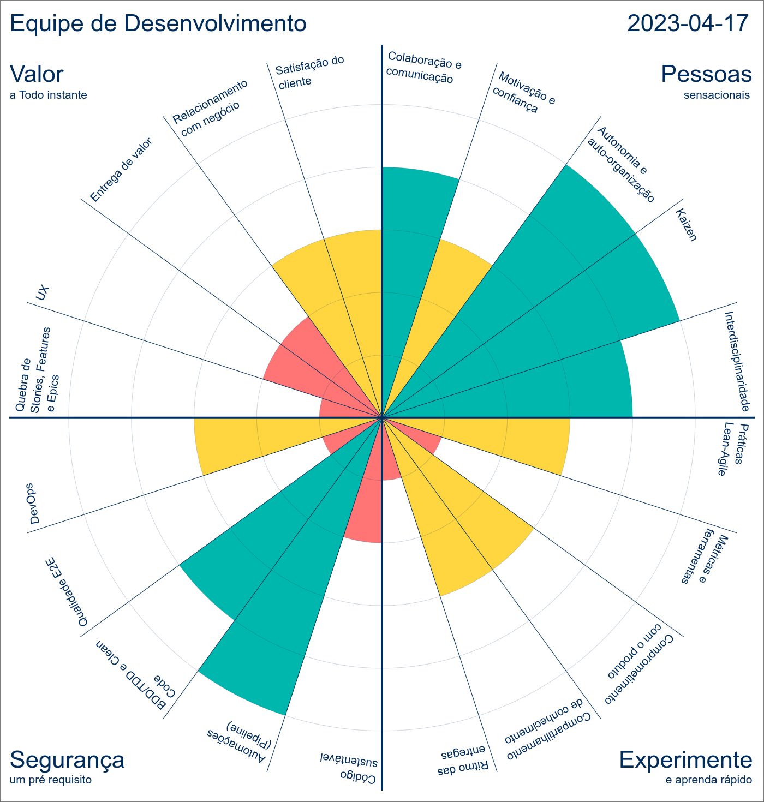

# Thalamus - Roda Ágil

Microsistema Roda Ágil para auxiliar na avaliação de agilidade de uma equipe de desenvolvimento.

Sistema disponível em: [https://rodaagil.agile.thalamus.digital/](https://thalamus.digital/)

Esta ferramenta foi construida com base na Roda Ágil da autora Ana G Soares.

